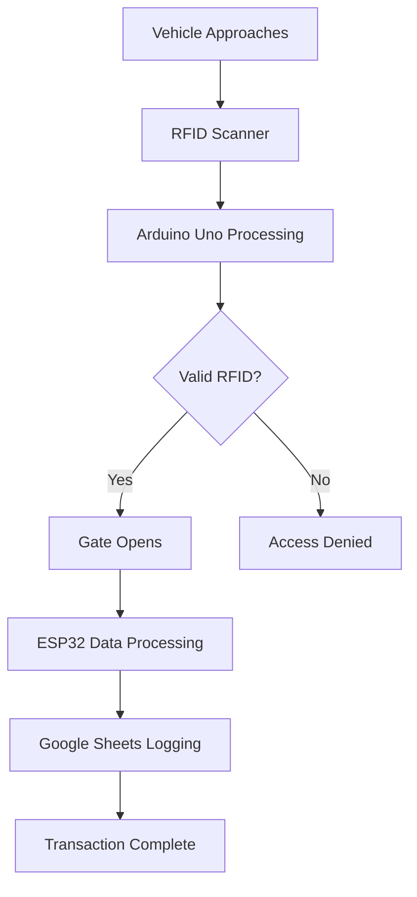
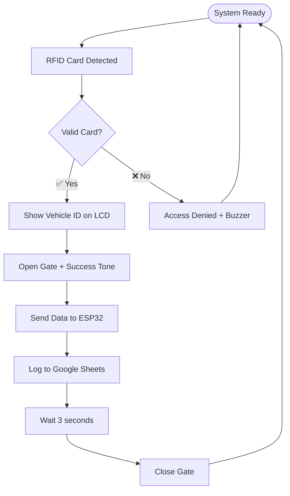

# 🚗 IoT Toll System Supervisor

[](https://ieeexplore.ieee.org/document/10993585)
[](#)
[](https://www.arduino.cc/)
[](https://www.espressif.com/en/products/socs/esp32)

> **Transformative IoT and Blockchain-based Automated Toll Collection System**

This project implements an **ESP32** and **Arduino Uno** powered automated toll collection system that combines IoT sensors with blockchain technology for secure, transparent, and reliable vehicle authentication and payment processing.

---

## 📋 Table of Contents

- [🎯 Overview](#-overview)
- [📄 Research Publication](#-research-publication)
- [✨ Key Features](#-key-features)
- [🛠️ Components Required](#️-components-required)
- [⚡ Hardware Setup](#-hardware-setup)
- [🔄 System Workflow](#-system-workflow)
- [🚀 Installation Guide](#-installation-guide)
- [💻 Code Architecture](#-code-architecture)
- [📸 Project Gallery](#-project-gallery)
- [🔮 Future Roadmap](#-future-roadmap)
- [🤝 Contributing](#-contributing)

---

## 🎯 Overview

The **IoT Toll System Supervisor** revolutionizes traditional toll collection by implementing a fully automated, IoT-enabled system that:

- **Eliminates manual intervention** through RFID-based vehicle authentication
- **Ensures secure transactions** using blockchain technology principles
- **Provides real-time monitoring** via Google Sheets integration
- **Enhances user experience** with instant gate operation and transparent billing

### 🏗️ System Architecture



---

## 📄 Research Publication

This project is backed by peer-reviewed research published in **IEEE Xplore**:

### 📖 **"IoT and Blockchain-based Automated Toll Collection System"**

> **Abstract:** This paper proposes a transformative solution for automated toll collection systems by integrating Internet of Things (IoT) and blockchain technology. The model aims to address challenges such as security breaches, lack of transparency, and unreliable transactions in current toll systems. Leveraging real-time data from IoT and the decentralised nature of blockchain, the proposed approach enhances security, ensures transparency, and improves overall reliability.

**📍 Publication Details:**
- **Conference:** 2024 International Conference on Communication, Computing and Energy Efficient Technologies (I3CEET)
- **Conference Dates:** September 20-21, 2024
- **IEEE Xplore Date:** May 13, 2025
- **Electronic ISBN:** 979-8-3315-4158-3
- **Print ISBN:** 979-8-3315-4159-0
- **🔗 [Read Full Paper](https://ieeexplore.ieee.org/document/10993585)**

---

## ✨ Key Features

| Feature | Description | Technology |
|---------|-------------|------------|
| 🔐 **Secure Authentication** | RFID-based vehicle identification | MFRC522 Module |
| 🚪 **Automated Gate Control** | Servo motor-operated barrier system | Servo Motor + Arduino |
| 📊 **Real-time Data Logging** | Cloud-based transaction recording | ESP32 + Google Sheets API |
| 🔊 **Audio Feedback** | Customizable alerts for system status | Buzzer Module |
| 📱 **Mobile Integration** | Real-time monitoring capabilities | WiFi + HTTP |
| 🛡️ **Security Validation** | Authorized-only access control | Database Validation |

---

## 🛠️ Components Required

### 🖥️ **Microcontrollers**
- **ESP32 Development Board** - IoT connectivity and data processing
- **Arduino Uno R3** - Main control unit for sensors and actuators

### 📡 **Sensors & Modules**
- **MFRC522 RFID Module** - Vehicle identification
- **16x2 LCD Display with I2C** - Status display
- **SG90 Servo Motor** - Gate mechanism
- **Active Buzzer Module** - Audio alerts

### 🔌 **Connectivity & Power**
- Jumper wires (Male-to-Male, Male-to-Female)
- Breadboard or PCB
- 5V Power Supply
- USB cables for programming

---

## ⚡ Hardware Setup

### 🔗 **Connection Diagram**

```
ESP32 ←→ Arduino Uno (Serial Communication)
   ↓
Arduino Uno Connections:
├── RFID (MFRC522)
│   ├── SDA → Pin 10
│   ├── SCK → Pin 13
│   ├── MOSI → Pin 11
│   ├── MISO → Pin 12
│   └── RST → Pin 9
├── Servo Motor → Pin 6
├── Buzzer → Pin 7
└── LCD (I2C)
    ├── SDA → A4
    └── SCL → A5
```

### 📋 **Pin Configuration Table**

| Component | Arduino Pin | ESP32 Pin | Notes |
|-----------|-------------|-----------|-------|
| RFID SDA | 10 | - | SPI Slave Select |
| RFID SCK | 13 | - | SPI Clock |
| RFID MOSI | 11 | - | SPI Master Out |
| RFID MISO | 12 | - | SPI Master In |
| RFID RST | 9 | - | Reset Pin |
| Servo PWM | 6 | - | PWM Control |
| Buzzer | 7 | - | Digital Output |
| LCD SDA | A4 | - | I2C Data |
| LCD SCL | A5 | - | I2C Clock |
| Serial RX | 0 | TX (GPIO1) | Communication |
| Serial TX | 1 | RX (GPIO3) | Communication |


---

## 🔄 System Workflow

### 🚦 **Operation Flow**



### 📝 **Step-by-Step Process**

1. **🔍 Detection Phase**
   - Vehicle approaches toll booth
   - RFID scanner activates and reads card

2. **🔐 Authentication Phase**
   - Arduino validates RFID against database
   - System determines access permission

3. **⚡ Action Phase**
   - Valid: Gate opens, LCD shows vehicle info
   - Invalid: Access denied, error buzzer sounds

4. **📊 Logging Phase**
   - ESP32 receives transaction data
   - Information logged to Google Sheets with timestamp

5. **🔄 Reset Phase**
   - Gate closes after delay
   - System returns to ready state


---

## 🚀 Installation Guide

### 📋 **Prerequisites**

- **Arduino IDE** (Version 1.8.13 or higher)
- **ESP32 Board Package** installed in Arduino IDE
- **Google Account** for Sheets integration
- **WiFi Network** for ESP32 connectivity

### 📚 **Required Libraries**

#### **Arduino Uno Libraries:**
```bash
# Install via Arduino Library Manager
- Wire.h (Built-in)
- LiquidCrystal_I2C.h
- Servo.h (Built-in)
- MFRC522.h
- SPI.h (Built-in)
- SoftwareSerial.h (Built-in)
```

#### **ESP32 Libraries:**
```bash
# Install via Arduino Library Manager
- WiFi.h (Built-in)
- HTTPClient.h (Built-in)
- TimeLib.h
```

### 🔧 **Step-by-Step Setup**

#### **1. Hardware Assembly**
```bash
1. Connect components according to wiring diagram
2. Double-check all connections
3. Ensure stable power supply to both boards
```

#### **2. Code Upload**
```bash
# Upload Arduino Uno Code
1. Select Board: "Arduino Uno"
2. Select correct COM Port
3. Upload the Arduino sketch

# Upload ESP32 Code  
1. Select Board: "ESP32 Dev Module"
2. Select correct COM Port
3. Upload the ESP32 sketch
```

#### **3. Google Sheets Configuration**

1. **Create Google Sheet:**
   ```
   - Create new Google Sheet
   - Set up columns: Date, Time, Vehicle_UID, Status
   ```

2. **Deploy Apps Script:**
   ```javascript
   // Create Google Apps Script web app
   // Set permissions to "Anyone can access"
   // Copy web app URL for ESP32 code
   ```

3. **Update ESP32 Code:**
   ```cpp
   // Replace with your Google Apps Script URL
   const char* serverName = "YOUR_GOOGLE_SCRIPT_URL_HERE";
   
   // Replace with your WiFi credentials
   const char* ssid = "YOUR_WIFI_SSID";
   const char* password = "YOUR_WIFI_PASSWORD";
   ```

#### **4. System Testing**

```bash
✅ Power on both Arduino and ESP32
✅ Check serial monitor for connection status
✅ Test with authorized RFID tag
✅ Verify gate operation and LCD display
✅ Confirm data logging in Google Sheets
```

---

## 💻 Code Architecture

### 🔧 **Arduino Uno - Main Controller**

**Core Responsibilities:**
- 🔍 RFID card scanning and validation
- 🚪 Servo motor gate control
- 📺 LCD status display management
- 🔊 Buzzer alert system
- 📡 Serial communication with ESP32

**Key Functions:**
```cpp
void setup()           // Initialize components
void loop()            // Main program loop  
void checkRFID()       // Scan and validate RFID
void operateGate()     // Control gate servo
void displayStatus()   // Update LCD display
void sendToESP32()     // Transmit data via serial
```

### 🌐 **ESP32 - IoT Gateway**

**Core Responsibilities:**
- 📶 WiFi connectivity management
- 📊 Data processing and validation
- ☁️ Google Sheets API integration
- ⏰ Timestamp generation
- 🔄 HTTP request handling

**Key Functions:**
```cpp
void setup()           // Initialize WiFi and components
void loop()            // Listen for Arduino data
void connectWiFi()     // Establish WiFi connection
void logToSheets()     // Send data to Google Sheets
void validateUID()     // Check UID format
```

---

## 📸 Project Gallery

### 🛠️ **Hardware Setup**


*Complete system assembly showing Arduino Uno, ESP32, RFID module, servo gate, and LCD display*

### 📱 **Mobile Integration**


*Real-time monitoring interface showing transaction logs and system status*

### 🎥 **System Demonstration**
[](https://github.com/user-attachments/assets/a4f83c5d-da9a-4461-9b8c-217969dc770b)

*Live demonstration of complete toll collection process from RFID scan to data logging*

---

## 🔮 Future Roadmap

### 🚀 **Phase 1: Enhanced Security**
- [ ] **Blockchain Integration** - Implement decentralized transaction validation
- [ ] **Encryption Protocol** - Add AES encryption for data transmission
- [ ] **Multi-factor Authentication** - Combine RFID with biometric verification

### 💳 **Phase 2: Payment Integration**
- [ ] **Digital Wallets** - Support for UPI, PayPal, cryptocurrency
- [ ] **Dynamic Pricing** - Peak hour and congestion-based toll calculation
- [ ] **Subscription Models** - Monthly/yearly toll passes

### 📊 **Phase 3: Analytics & AI**
- [ ] **Traffic Analytics** - Real-time traffic flow analysis
- [ ] **Predictive Maintenance** - AI-powered system health monitoring
- [ ] **Revenue Optimization** - Machine learning for toll pricing

### 🌐 **Phase 4: Smart Infrastructure**
- [ ] **5G Connectivity** - Ultra-low latency communication
- [ ] **Edge Computing** - Local processing for faster response
- [ ] **Smart City Integration** - Connect with city-wide traffic management

---

## 🤝 Contributing

We welcome contributions to improve the IoT Toll System! Here's how you can help:

### 🛠️ **Development Setup**
```bash
1. Fork the repository
2. Clone your fork locally
3. Create a feature branch
4. Make your changes
5. Test thoroughly
6. Submit a pull request
```

### 📝 **Contribution Guidelines**
- Follow Arduino coding standards
- Include comments for complex logic
- Test all hardware connections
- Update documentation for new features
- Ensure backward compatibility

### 🐛 **Bug Reports**
- Use GitHub Issues for bug reports
- Include system specifications
- Provide detailed error descriptions
- Add photos/videos if helpful

---

## 📞 **Support & Contact**

- **📧 Email:** aadityapanda23@gmail.com
- **🐙 GitHub Issues:** [[Repository Issues]](https://github.com/AadityaPanda/ITSS/issues)
- **📄 IEEE Paper:** [https://ieeexplore.ieee.org/document/10993585](https://ieeexplore.ieee.org/document/10993585)

---

## 📄 **License**

This project is licensed under the MIT License - see the [LICENSE](LICENSE) file for details.

---

**⭐ If this project helped you, please give it a star on GitHub!**

*Built with ❤️ for the future of smart transportation*
